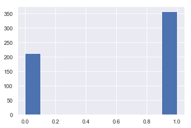
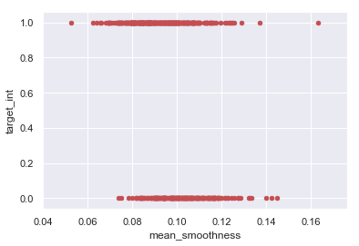
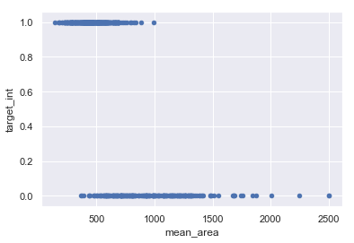
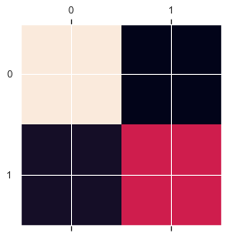
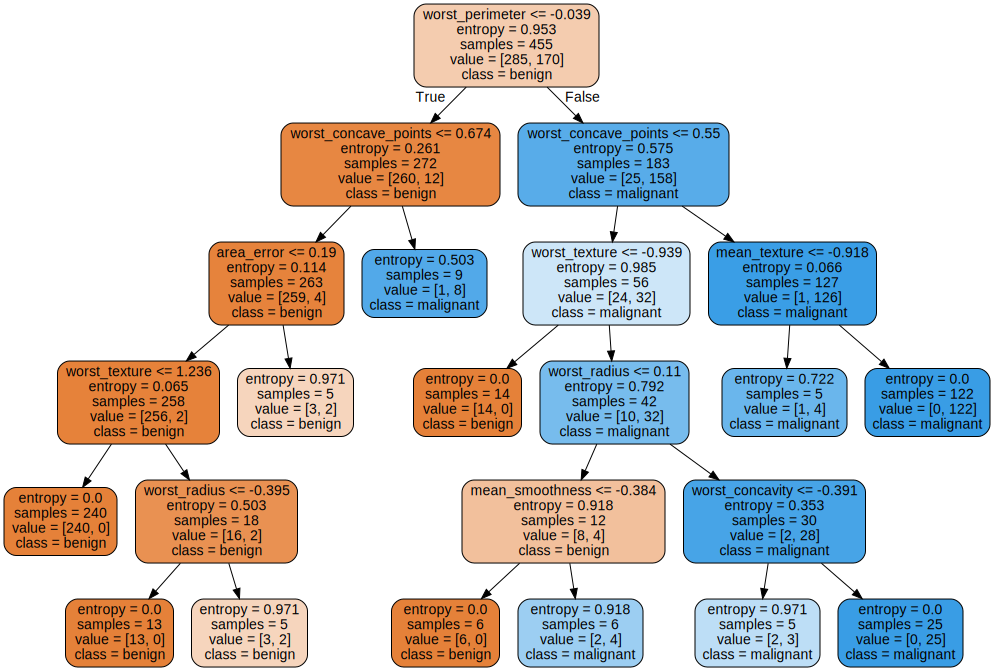

```python
import pandas as pd
import numpy as np
from sklearn import datasets
import seaborn as sns #visualisation
import matplotlib.pyplot as plt #visualisation
%matplotlib inline 
sns.set(color_codes=True)


```


```python
dataset = datasets.load_breast_cancer()

df = pd.read_csv(dataset.filename)
df.head()
data = pd.DataFrame(dataset['data'], columns=['mean_radius','mean_texture','mean_perimeter','mean_area',
                                              'mean_smoothness','mean_compactness','mean_concavity',
                                              'mean_concave_points','mean_symmetry','mean_fractal_dimension',
                                              'radius_error','texture_error','perimeter_error','area_error',
                                              'smoothness_error','compactness_error','concavity_error',
                                              'concave_points_error','symmetry_error','fractal_dimension_error',
                                              'worst_radius','worst_texture','worst_perimeter','worst_area',
                                              'worst_smoothness','worst_compactness','worst_concavity',
                                              'worst_concave_points','worst_symmetry', 'worst_fractal_dimension',])

data['target_int'] = dataset.target
data['target_text'] =  dataset.target
data['target_text'] = data['target_text'].apply(lambda x: dataset['target_names'][x])
data['target_int'] = data['target_int'].apply(lambda x: int(x))
print dataset.target_names
print dataset.feature_names
data.head()
```

    ['malignant' 'benign']
    ['mean radius' 'mean texture' 'mean perimeter' 'mean area'
     'mean smoothness' 'mean compactness' 'mean concavity'
     'mean concave points' 'mean symmetry' 'mean fractal dimension'
     'radius error' 'texture error' 'perimeter error' 'area error'
     'smoothness error' 'compactness error' 'concavity error'
     'concave points error' 'symmetry error' 'fractal dimension error'
     'worst radius' 'worst texture' 'worst perimeter' 'worst area'
     'worst smoothness' 'worst compactness' 'worst concavity'
     'worst concave points' 'worst symmetry' 'worst fractal dimension']
    


<div>
<style scoped>
    .dataframe tbody tr th:only-of-type {
        vertical-align: middle;
    }

    .dataframe tbody tr th {
        vertical-align: top;
    }

    .dataframe thead th {
        text-align: right;
    }
</style>
<table border="1" class="dataframe">
  <thead>
    <tr style="text-align: right;">
      <th></th>
      <th>mean_radius</th>
      <th>mean_texture</th>
      <th>mean_perimeter</th>
      <th>mean_area</th>
      <th>mean_smoothness</th>
      <th>mean_compactness</th>
      <th>mean_concavity</th>
      <th>mean_concave_points</th>
      <th>mean_symmetry</th>
      <th>mean_fractal_dimension</th>
      <th>...</th>
      <th>worst_perimeter</th>
      <th>worst_area</th>
      <th>worst_smoothness</th>
      <th>worst_compactness</th>
      <th>worst_concavity</th>
      <th>worst_concave_points</th>
      <th>worst_symmetry</th>
      <th>worst_fractal_dimension</th>
      <th>target_int</th>
      <th>target_text</th>
    </tr>
  </thead>
  <tbody>
    <tr>
      <th>0</th>
      <td>17.99</td>
      <td>10.38</td>
      <td>122.80</td>
      <td>1001.0</td>
      <td>0.11840</td>
      <td>0.27760</td>
      <td>0.3001</td>
      <td>0.14710</td>
      <td>0.2419</td>
      <td>0.07871</td>
      <td>...</td>
      <td>184.60</td>
      <td>2019.0</td>
      <td>0.1622</td>
      <td>0.6656</td>
      <td>0.7119</td>
      <td>0.2654</td>
      <td>0.4601</td>
      <td>0.11890</td>
      <td>0</td>
      <td>malignant</td>
    </tr>
    <tr>
      <th>1</th>
      <td>20.57</td>
      <td>17.77</td>
      <td>132.90</td>
      <td>1326.0</td>
      <td>0.08474</td>
      <td>0.07864</td>
      <td>0.0869</td>
      <td>0.07017</td>
      <td>0.1812</td>
      <td>0.05667</td>
      <td>...</td>
      <td>158.80</td>
      <td>1956.0</td>
      <td>0.1238</td>
      <td>0.1866</td>
      <td>0.2416</td>
      <td>0.1860</td>
      <td>0.2750</td>
      <td>0.08902</td>
      <td>0</td>
      <td>malignant</td>
    </tr>
    <tr>
      <th>2</th>
      <td>19.69</td>
      <td>21.25</td>
      <td>130.00</td>
      <td>1203.0</td>
      <td>0.10960</td>
      <td>0.15990</td>
      <td>0.1974</td>
      <td>0.12790</td>
      <td>0.2069</td>
      <td>0.05999</td>
      <td>...</td>
      <td>152.50</td>
      <td>1709.0</td>
      <td>0.1444</td>
      <td>0.4245</td>
      <td>0.4504</td>
      <td>0.2430</td>
      <td>0.3613</td>
      <td>0.08758</td>
      <td>0</td>
      <td>malignant</td>
    </tr>
    <tr>
      <th>3</th>
      <td>11.42</td>
      <td>20.38</td>
      <td>77.58</td>
      <td>386.1</td>
      <td>0.14250</td>
      <td>0.28390</td>
      <td>0.2414</td>
      <td>0.10520</td>
      <td>0.2597</td>
      <td>0.09744</td>
      <td>...</td>
      <td>98.87</td>
      <td>567.7</td>
      <td>0.2098</td>
      <td>0.8663</td>
      <td>0.6869</td>
      <td>0.2575</td>
      <td>0.6638</td>
      <td>0.17300</td>
      <td>0</td>
      <td>malignant</td>
    </tr>
    <tr>
      <th>4</th>
      <td>20.29</td>
      <td>14.34</td>
      <td>135.10</td>
      <td>1297.0</td>
      <td>0.10030</td>
      <td>0.13280</td>
      <td>0.1980</td>
      <td>0.10430</td>
      <td>0.1809</td>
      <td>0.05883</td>
      <td>...</td>
      <td>152.20</td>
      <td>1575.0</td>
      <td>0.1374</td>
      <td>0.2050</td>
      <td>0.4000</td>
      <td>0.1625</td>
      <td>0.2364</td>
      <td>0.07678</td>
      <td>0</td>
      <td>malignant</td>
    </tr>
  </tbody>
</table>
<p>5 rows × 32 columns</p>
</div>


```python
print data.shape
print data.columns
data['target_int'].hist()

```

    (569, 32)
    Index([u'mean_radius', u'mean_texture', u'mean_perimeter', u'mean_area',
           u'mean_smoothness', u'mean_compactness', u'mean_concavity',
           u'mean_concave_points', u'mean_symmetry', u'mean_fractal_dimension',
           u'radius_error', u'texture_error', u'perimeter_error', u'area_error',
           u'smoothness_error', u'compactness_error', u'concavity_error',
           u'concave_points_error', u'symmetry_error', u'fractal_dimension_error',
           u'worst_radius', u'worst_texture', u'worst_perimeter', u'worst_area',
           u'worst_smoothness', u'worst_compactness', u'worst_concavity',
           u'worst_concave_points', u'worst_symmetry', u'worst_fractal_dimension',
           u'target_int', u'target_text'],
          dtype='object')
    


    <matplotlib.axes._subplots.AxesSubplot at 0xd64a320>





```python
data.plot(kind='scatter',x='mean_smoothness',y='target_int', c= 'r')
plt.show()
```





```python
data.plot(kind='scatter',x='mean_area',y='target_int', c= 'b')
plt.show()
```





```python
data.describe()
```


<div>
<style scoped>
    .dataframe tbody tr th:only-of-type {
        vertical-align: middle;
    }

    .dataframe tbody tr th {
        vertical-align: top;
    }

    .dataframe thead th {
        text-align: right;
    }
</style>
<table border="1" class="dataframe">
  <thead>
    <tr style="text-align: right;">
      <th></th>
      <th>mean_radius</th>
      <th>mean_texture</th>
      <th>mean_perimeter</th>
      <th>mean_area</th>
      <th>mean_smoothness</th>
      <th>mean_compactness</th>
      <th>mean_concavity</th>
      <th>mean_concave_points</th>
      <th>mean_symmetry</th>
      <th>mean_fractal_dimension</th>
      <th>...</th>
      <th>worst_texture</th>
      <th>worst_perimeter</th>
      <th>worst_area</th>
      <th>worst_smoothness</th>
      <th>worst_compactness</th>
      <th>worst_concavity</th>
      <th>worst_concave_points</th>
      <th>worst_symmetry</th>
      <th>worst_fractal_dimension</th>
      <th>target_int</th>
    </tr>
  </thead>
  <tbody>
    <tr>
      <th>count</th>
      <td>569.000000</td>
      <td>569.000000</td>
      <td>569.000000</td>
      <td>569.000000</td>
      <td>569.000000</td>
      <td>569.000000</td>
      <td>569.000000</td>
      <td>569.000000</td>
      <td>569.000000</td>
      <td>569.000000</td>
      <td>...</td>
      <td>569.000000</td>
      <td>569.000000</td>
      <td>569.000000</td>
      <td>569.000000</td>
      <td>569.000000</td>
      <td>569.000000</td>
      <td>569.000000</td>
      <td>569.000000</td>
      <td>569.000000</td>
      <td>569.000000</td>
    </tr>
    <tr>
      <th>mean</th>
      <td>14.127292</td>
      <td>19.289649</td>
      <td>91.969033</td>
      <td>654.889104</td>
      <td>0.096360</td>
      <td>0.104341</td>
      <td>0.088799</td>
      <td>0.048919</td>
      <td>0.181162</td>
      <td>0.062798</td>
      <td>...</td>
      <td>25.677223</td>
      <td>107.261213</td>
      <td>880.583128</td>
      <td>0.132369</td>
      <td>0.254265</td>
      <td>0.272188</td>
      <td>0.114606</td>
      <td>0.290076</td>
      <td>0.083946</td>
      <td>0.627417</td>
    </tr>
    <tr>
      <th>std</th>
      <td>3.524049</td>
      <td>4.301036</td>
      <td>24.298981</td>
      <td>351.914129</td>
      <td>0.014064</td>
      <td>0.052813</td>
      <td>0.079720</td>
      <td>0.038803</td>
      <td>0.027414</td>
      <td>0.007060</td>
      <td>...</td>
      <td>6.146258</td>
      <td>33.602542</td>
      <td>569.356993</td>
      <td>0.022832</td>
      <td>0.157336</td>
      <td>0.208624</td>
      <td>0.065732</td>
      <td>0.061867</td>
      <td>0.018061</td>
      <td>0.483918</td>
    </tr>
    <tr>
      <th>min</th>
      <td>6.981000</td>
      <td>9.710000</td>
      <td>43.790000</td>
      <td>143.500000</td>
      <td>0.052630</td>
      <td>0.019380</td>
      <td>0.000000</td>
      <td>0.000000</td>
      <td>0.106000</td>
      <td>0.049960</td>
      <td>...</td>
      <td>12.020000</td>
      <td>50.410000</td>
      <td>185.200000</td>
      <td>0.071170</td>
      <td>0.027290</td>
      <td>0.000000</td>
      <td>0.000000</td>
      <td>0.156500</td>
      <td>0.055040</td>
      <td>0.000000</td>
    </tr>
    <tr>
      <th>25%</th>
      <td>11.700000</td>
      <td>16.170000</td>
      <td>75.170000</td>
      <td>420.300000</td>
      <td>0.086370</td>
      <td>0.064920</td>
      <td>0.029560</td>
      <td>0.020310</td>
      <td>0.161900</td>
      <td>0.057700</td>
      <td>...</td>
      <td>21.080000</td>
      <td>84.110000</td>
      <td>515.300000</td>
      <td>0.116600</td>
      <td>0.147200</td>
      <td>0.114500</td>
      <td>0.064930</td>
      <td>0.250400</td>
      <td>0.071460</td>
      <td>0.000000</td>
    </tr>
    <tr>
      <th>50%</th>
      <td>13.370000</td>
      <td>18.840000</td>
      <td>86.240000</td>
      <td>551.100000</td>
      <td>0.095870</td>
      <td>0.092630</td>
      <td>0.061540</td>
      <td>0.033500</td>
      <td>0.179200</td>
      <td>0.061540</td>
      <td>...</td>
      <td>25.410000</td>
      <td>97.660000</td>
      <td>686.500000</td>
      <td>0.131300</td>
      <td>0.211900</td>
      <td>0.226700</td>
      <td>0.099930</td>
      <td>0.282200</td>
      <td>0.080040</td>
      <td>1.000000</td>
    </tr>
    <tr>
      <th>75%</th>
      <td>15.780000</td>
      <td>21.800000</td>
      <td>104.100000</td>
      <td>782.700000</td>
      <td>0.105300</td>
      <td>0.130400</td>
      <td>0.130700</td>
      <td>0.074000</td>
      <td>0.195700</td>
      <td>0.066120</td>
      <td>...</td>
      <td>29.720000</td>
      <td>125.400000</td>
      <td>1084.000000</td>
      <td>0.146000</td>
      <td>0.339100</td>
      <td>0.382900</td>
      <td>0.161400</td>
      <td>0.317900</td>
      <td>0.092080</td>
      <td>1.000000</td>
    </tr>
    <tr>
      <th>max</th>
      <td>28.110000</td>
      <td>39.280000</td>
      <td>188.500000</td>
      <td>2501.000000</td>
      <td>0.163400</td>
      <td>0.345400</td>
      <td>0.426800</td>
      <td>0.201200</td>
      <td>0.304000</td>
      <td>0.097440</td>
      <td>...</td>
      <td>49.540000</td>
      <td>251.200000</td>
      <td>4254.000000</td>
      <td>0.222600</td>
      <td>1.058000</td>
      <td>1.252000</td>
      <td>0.291000</td>
      <td>0.663800</td>
      <td>0.207500</td>
      <td>1.000000</td>
    </tr>
  </tbody>
</table>
<p>8 rows × 31 columns</p>
</div>


```python
data.isnull().sum()
```


    mean_radius                0
    mean_texture               0
    mean_perimeter             0
    mean_area                  0
    mean_smoothness            0
    mean_compactness           0
    mean_concavity             0
    mean_concave_points        0
    mean_symmetry              0
    mean_fractal_dimension     0
    radius_error               0
    texture_error              0
    perimeter_error            0
    area_error                 0
    smoothness_error           0
    compactness_error          0
    concavity_error            0
    concave_points_error       0
    symmetry_error             0
    fractal_dimension_error    0
    worst_radius               0
    worst_texture              0
    worst_perimeter            0
    worst_area                 0
    worst_smoothness           0
    worst_compactness          0
    worst_concavity            0
    worst_concave_points       0
    worst_symmetry             0
    worst_fractal_dimension    0
    target_int                 0
    target_text                0
    dtype: int64


```python
modData = data.append({'mean_radius': np.nan,'mean_texture': 0.2,'mean_perimeter': 0.2,'mean_area': 0.2,
                       'mean_smoothness': 0.2,'mean_compactness': 0.2,'mean_concavity': 0.2,
                       'mean_concave_points': 0.2,'mean_symmetry': 0.2,'mean_fractal_dimension': 0.2,
                       'radius_error': 0.2,'texture_error': 0.2,'perimeter_error': 0.2,'area_error': 0.2,
                       'smoothness_error': 0.2,'compactness_error': 0.2,'concavity_error': 0.2,
                       'concave_points_error': 0.2,'symmetry_error': 0.2,'fractal_dimension_error': 0.2,
                       'worst_radius': 0.2,'worst_texture': 0.2,'worst_perimeter': 0.2,'worst_area': 0.2,
                       'worst_smoothness': 0.2,'worst_compactness': 0.6,'worst_concavity': 0.2,
                       'worst_concave_points': 0.2,'worst_symmetry': 0.2, 'worst_fractal_dimension': 0.2,
                       'target_int':0,'target_text' : 'malignant'},
                      ignore_index=True)

modData.describe()

```


<div>
<style scoped>
    .dataframe tbody tr th:only-of-type {
        vertical-align: middle;
    }

    .dataframe tbody tr th {
        vertical-align: top;
    }

    .dataframe thead th {
        text-align: right;
    }
</style>
<table border="1" class="dataframe">
  <thead>
    <tr style="text-align: right;">
      <th></th>
      <th>mean_radius</th>
      <th>mean_texture</th>
      <th>mean_perimeter</th>
      <th>mean_area</th>
      <th>mean_smoothness</th>
      <th>mean_compactness</th>
      <th>mean_concavity</th>
      <th>mean_concave_points</th>
      <th>mean_symmetry</th>
      <th>mean_fractal_dimension</th>
      <th>...</th>
      <th>worst_texture</th>
      <th>worst_perimeter</th>
      <th>worst_area</th>
      <th>worst_smoothness</th>
      <th>worst_compactness</th>
      <th>worst_concavity</th>
      <th>worst_concave_points</th>
      <th>worst_symmetry</th>
      <th>worst_fractal_dimension</th>
      <th>target_int</th>
    </tr>
  </thead>
  <tbody>
    <tr>
      <th>count</th>
      <td>569.000000</td>
      <td>570.000000</td>
      <td>570.000000</td>
      <td>570.000000</td>
      <td>570.000000</td>
      <td>570.000000</td>
      <td>570.000000</td>
      <td>570.000000</td>
      <td>570.000000</td>
      <td>570.000000</td>
      <td>...</td>
      <td>570.000000</td>
      <td>570.000000</td>
      <td>570.000000</td>
      <td>570.000000</td>
      <td>570.000000</td>
      <td>570.000000</td>
      <td>570.000000</td>
      <td>570.000000</td>
      <td>570.000000</td>
      <td>570.000000</td>
    </tr>
    <tr>
      <th>mean</th>
      <td>14.127292</td>
      <td>19.256158</td>
      <td>91.808035</td>
      <td>653.740526</td>
      <td>0.096542</td>
      <td>0.104509</td>
      <td>0.088994</td>
      <td>0.049184</td>
      <td>0.181195</td>
      <td>0.063038</td>
      <td>...</td>
      <td>25.632526</td>
      <td>107.073386</td>
      <td>879.038596</td>
      <td>0.132487</td>
      <td>0.254872</td>
      <td>0.272062</td>
      <td>0.114756</td>
      <td>0.289918</td>
      <td>0.084149</td>
      <td>0.626316</td>
    </tr>
    <tr>
      <th>std</th>
      <td>3.524049</td>
      <td>4.371009</td>
      <td>24.580022</td>
      <td>352.672460</td>
      <td>0.014707</td>
      <td>0.052918</td>
      <td>0.079786</td>
      <td>0.039282</td>
      <td>0.027402</td>
      <td>0.009099</td>
      <td>...</td>
      <td>6.232884</td>
      <td>33.871159</td>
      <td>570.050393</td>
      <td>0.022988</td>
      <td>0.157864</td>
      <td>0.208463</td>
      <td>0.065772</td>
      <td>0.061928</td>
      <td>0.018689</td>
      <td>0.484206</td>
    </tr>
    <tr>
      <th>min</th>
      <td>6.981000</td>
      <td>0.200000</td>
      <td>0.200000</td>
      <td>0.200000</td>
      <td>0.052630</td>
      <td>0.019380</td>
      <td>0.000000</td>
      <td>0.000000</td>
      <td>0.106000</td>
      <td>0.049960</td>
      <td>...</td>
      <td>0.200000</td>
      <td>0.200000</td>
      <td>0.200000</td>
      <td>0.071170</td>
      <td>0.027290</td>
      <td>0.000000</td>
      <td>0.000000</td>
      <td>0.156500</td>
      <td>0.055040</td>
      <td>0.000000</td>
    </tr>
    <tr>
      <th>25%</th>
      <td>11.700000</td>
      <td>16.170000</td>
      <td>75.065000</td>
      <td>419.925000</td>
      <td>0.086380</td>
      <td>0.065005</td>
      <td>0.029565</td>
      <td>0.020323</td>
      <td>0.161925</td>
      <td>0.057725</td>
      <td>...</td>
      <td>21.065000</td>
      <td>84.087500</td>
      <td>514.325000</td>
      <td>0.116600</td>
      <td>0.147325</td>
      <td>0.114975</td>
      <td>0.064943</td>
      <td>0.250250</td>
      <td>0.071462</td>
      <td>0.000000</td>
    </tr>
    <tr>
      <th>50%</th>
      <td>13.370000</td>
      <td>18.835000</td>
      <td>86.210000</td>
      <td>548.750000</td>
      <td>0.095895</td>
      <td>0.093125</td>
      <td>0.061545</td>
      <td>0.033600</td>
      <td>0.179250</td>
      <td>0.061545</td>
      <td>...</td>
      <td>25.405000</td>
      <td>97.655000</td>
      <td>685.550000</td>
      <td>0.131350</td>
      <td>0.213000</td>
      <td>0.226550</td>
      <td>0.100015</td>
      <td>0.282050</td>
      <td>0.080050</td>
      <td>1.000000</td>
    </tr>
    <tr>
      <th>75%</th>
      <td>15.780000</td>
      <td>21.795000</td>
      <td>104.025000</td>
      <td>782.675000</td>
      <td>0.105375</td>
      <td>0.130475</td>
      <td>0.131600</td>
      <td>0.074030</td>
      <td>0.195700</td>
      <td>0.066143</td>
      <td>...</td>
      <td>29.705000</td>
      <td>125.325000</td>
      <td>1080.500000</td>
      <td>0.146075</td>
      <td>0.339700</td>
      <td>0.382400</td>
      <td>0.162225</td>
      <td>0.317825</td>
      <td>0.092088</td>
      <td>1.000000</td>
    </tr>
    <tr>
      <th>max</th>
      <td>28.110000</td>
      <td>39.280000</td>
      <td>188.500000</td>
      <td>2501.000000</td>
      <td>0.200000</td>
      <td>0.345400</td>
      <td>0.426800</td>
      <td>0.201200</td>
      <td>0.304000</td>
      <td>0.200000</td>
      <td>...</td>
      <td>49.540000</td>
      <td>251.200000</td>
      <td>4254.000000</td>
      <td>0.222600</td>
      <td>1.058000</td>
      <td>1.252000</td>
      <td>0.291000</td>
      <td>0.663800</td>
      <td>0.207500</td>
      <td>1.000000</td>
    </tr>
  </tbody>
</table>
<p>8 rows × 31 columns</p>
</div>


```python
print('Columns with missing values')
print(modData.isnull().sum())
```

    Columns with missing values
    mean_radius                1
    mean_texture               0
    mean_perimeter             0
    mean_area                  0
    mean_smoothness            0
    mean_compactness           0
    mean_concavity             0
    mean_concave_points        0
    mean_symmetry              0
    mean_fractal_dimension     0
    radius_error               0
    texture_error              0
    perimeter_error            0
    area_error                 0
    smoothness_error           0
    compactness_error          0
    concavity_error            0
    concave_points_error       0
    symmetry_error             0
    fractal_dimension_error    0
    worst_radius               0
    worst_texture              0
    worst_perimeter            0
    worst_area                 0
    worst_smoothness           0
    worst_compactness          0
    worst_concavity            0
    worst_concave_points       0
    worst_symmetry             0
    worst_fractal_dimension    0
    target_int                 0
    target_text                0
    dtype: int64
    


```python
# fill missing values with mean column values
modData.fillna(modData.mean(), inplace=True)
# count the number of NaN values in each column
print(modData.isnull().sum())
```

    mean_radius                0
    mean_texture               0
    mean_perimeter             0
    mean_area                  0
    mean_smoothness            0
    mean_compactness           0
    mean_concavity             0
    mean_concave_points        0
    mean_symmetry              0
    mean_fractal_dimension     0
    radius_error               0
    texture_error              0
    perimeter_error            0
    area_error                 0
    smoothness_error           0
    compactness_error          0
    concavity_error            0
    concave_points_error       0
    symmetry_error             0
    fractal_dimension_error    0
    worst_radius               0
    worst_texture              0
    worst_perimeter            0
    worst_area                 0
    worst_smoothness           0
    worst_compactness          0
    worst_concavity            0
    worst_concave_points       0
    worst_symmetry             0
    worst_fractal_dimension    0
    target_int                 0
    target_text                0
    dtype: int64
    


```python
from sklearn.preprocessing import StandardScaler, MinMaxScaler
features = ['mean_radius','mean_texture','mean_perimeter','mean_area',
                                              'mean_smoothness','mean_compactness','mean_concavity',
                                              'mean_concave_points','mean_symmetry','mean_fractal_dimension',
                                              'radius_error','texture_error','perimeter_error','area_error',
                                              'smoothness_error','compactness_error','concavity_error',
                                              'concave_points_error','symmetry_error','fractal_dimension_error',
                                              'worst_radius','worst_texture','worst_perimeter','worst_area',
                                              'worst_smoothness','worst_compactness','worst_concavity',
                                              'worst_concave_points','worst_symmetry', 'worst_fractal_dimension',]
x = data.loc[:, features].values
# Separating out the target
y = data.loc[:,['target_int']].values
# Standardizing the features
x = StandardScaler().fit_transform(x)
print (x)
```

    [[ 1.09706398 -2.07333501  1.26993369 ...  2.29607613  2.75062224
       1.93701461]
     [ 1.82982061 -0.35363241  1.68595471 ...  1.0870843  -0.24388967
       0.28118999]
     [ 1.57988811  0.45618695  1.56650313 ...  1.95500035  1.152255
       0.20139121]
     ...
     [ 0.70228425  2.0455738   0.67267578 ...  0.41406869 -1.10454895
      -0.31840916]
     [ 1.83834103  2.33645719  1.98252415 ...  2.28998549  1.91908301
       2.21963528]
     [-1.80840125  1.22179204 -1.81438851 ... -1.74506282 -0.04813821
      -0.75120669]]
    


```python
from sklearn.decomposition import PCA
pca = PCA(n_components=2)
principalComponents = pca.fit_transform(x)
principalDf = pd.DataFrame(data = principalComponents
             , columns = ['principal component 1', 'principal component 2'])

finalDf = pd.concat([principalDf, data[['target_int']]], axis = 1)
```


```python
from sklearn.preprocessing import LabelEncoder
from sklearn.tree import DecisionTreeClassifier, export_graphviz
from sklearn.model_selection import train_test_split
from sklearn.metrics import accuracy_score
seed = 1
```


```python
# X = data.drop('target_text', axis=1).values
# Splitting into train and test sets.
y = data['target_text'].values

X_train, X_test, y_train, y_test = train_test_split(x, y, test_size=0.2, stratify=y, random_state=seed)

```


```python
tree = DecisionTreeClassifier(criterion='entropy',
                              min_samples_leaf=5,
                              min_samples_split=5,
                              max_depth=None,
                              random_state=seed)
tree.fit(X_train, y_train)
y_pred = tree.predict(X_test)
accuracy = accuracy_score(y_test, y_pred)
print('DecisionTreeClassifier accuracy score: {}'.format(accuracy))
```

    DecisionTreeClassifier accuracy score: 0.947368421053
    


```python
from sklearn.metrics import confusion_matrix
import matplotlib.pyplot as plt

print('Confusion Matrix is')
print(confusion_matrix(y_test, y_pred))
cm=confusion_matrix(y_test, y_pred)
plt.matshow(cm)
plt.show()
```

    Confusion Matrix is
    [[71  1]
     [ 5 37]]
    





```python
from sklearn.metrics import classification_report

print(classification_report(y_test, y_pred, labels=data['target_text'].unique()))
```

                  precision    recall  f1-score   support
    
       malignant       0.97      0.88      0.93        42
          benign       0.93      0.99      0.96        72
    
       micro avg       0.95      0.95      0.95       114
       macro avg       0.95      0.93      0.94       114
    weighted avg       0.95      0.95      0.95       114
    
    


```python
import os
import graphviz
os.environ["PATH"] += os.pathsep + 'C:/Program Files (x86)/Graphviz2.38/bin/'
def plot_tree(tree, dataframe, label_col, label_encoder, plot_title):
    label_names = ['benign','malignant']
    # Obtaining plot data.
    d = dataframe.drop('target_text', axis=1)
    d  = d.drop('target_int', axis=1)
    graph_data = export_graphviz(tree,
                                 feature_names=d.columns,
                                 class_names=label_names,
                                 filled=True,
                                 rounded=True,
                                 out_file=None)
    # Generating plot.
    graph = graphviz.Source(graph_data)
    graph.render(plot_title, view = True)
    return graph

tree_graph = plot_tree(tree, data, 'target_text', None, 'file1.pdf')
tree_graph
```





